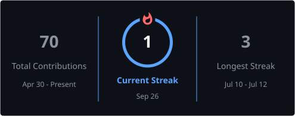

<h1 align="center">Hanzla Baig</h1>

<!-- Typing SVG -->

  

<!-- Badges Row -->

   
  
  &nbsp;
  
  &nbsp;
  
  &nbsp;
  

 

---

## 👋 About Me

- 🚀 &nbsp;**Full-Stack Developer** building fast, reliable, production-grade web products
- 🧩 &nbsp;**Next.js, React, Node.js, Express, TypeScript** with **Supabase, Turso & MySQL**
- ⚡ &nbsp;Real-time apps with **WebRTC & Socket.IO** — chat, screen sharing, live collaboration
- 🔧 &nbsp;**WordPress, WooCommerce & Shopify** — custom themes, plugins & stores
- 🤖 &nbsp;**AI automation & AI agents** (LLMs, OpenRouter, n8n, Zapier, Make.com) plus **Meta Ads-ready funnels**
- 🏢 &nbsp;Co-founder of **[The Bit Forge](https://thebitforge.dev)** — web development agency
- 💼 &nbsp;Website Developer at **Digital Uqaab Agency**
- ✍️ &nbsp;Writing at **[dev.to/hanzla](https://dev.to/hanzla)** and on my **[blog](https://hanzla-baig-developer.vercel.app)**
- 📍 &nbsp;Based in **Chichawatni, Pakistan**
- 📫 &nbsp;Reach me at **hanzlabaig.real@gmail.com**
- 🗂️ &nbsp;Older projects: **[previous GitHub profile](https://github.com/wecoded-dev)**

 

> 💡 *"Design is not just what it looks like — design is how it works."* — **Steve Jobs**

---

## 🌐 Connect With Me

---

   ## 🚀 My Repositories

   <!-- PROJECTS-LIST:START -->
| Project | Description | Language | Stars |
|---|---|---|---|
| [Target-Human](https://github.com/hanzlabaig-dev/Target-Human) | Real-time face recognition & tracking tool using InsightFace + OpenCV — enrolls people from photos, locks onto and auto-photographs matches in live camera feeds, even at a distance or in crowds. | Python | ⭐ 0 |
| [Controlled-Web-AI-Agent](https://github.com/hanzlabaig-dev/Controlled-Web-AI-Agent) | Controlled Web AI Agent V2 — A Python tool-calling AI agent for web research, website security analysis, file management, and approved terminal commands, with built-in SSRF protection, domain locking, human approval gates, and safety controls. | Python | ⭐ 1 |
| [ai-web-agent](https://github.com/hanzlabaig-dev/ai-web-agent) | Educational LLM agent framework for authorized security inspection of a single website you own. Domain-locked, human-approved, Python-enforced. | Python | ⭐ 0 |
| [aicli](https://github.com/hanzlabaig-dev/aicli) | A production-quality terminal-based AI Coding CLI supporting OpenRouter, Anthropic, OpenAI, Gemini and Ollama | TypeScript | ⭐ 2 |
| [handtracker](https://github.com/hanzlabaig-dev/handtracker) | No description yet | HTML | ⭐ 0 |
| [screencast](https://github.com/hanzlabaig-dev/screencast) | No description yet | JavaScript | ⭐ 0 |
| [blog-platform](https://github.com/hanzlabaig-dev/blog-platform) | No description yet | TypeScript | ⭐ 0 |
| [portfolio](https://github.com/hanzlabaig-dev/portfolio) | No description yet | - | ⭐ 0 |
| [chatbot](https://github.com/hanzlabaig-dev/chatbot) | No description yet | - | ⭐ 0 |
<!-- PROJECTS-LIST:END -->

---

## 🚀 Featured Projects

| Project | What it is | Stack |
|:---|:---|:---|
| **[GenZHub](https://genzhub.shop)** *(client project)* | Live client store built and delivered end to end | E-commerce · Full-Stack |
| **[RiseUp Lifts](https://riseuplifts.com)** *(client project)* | Storefront for a 24/7 elevator installation & maintenance company, built to showcase certifications and drive inbound leads | Web Design · Service Business |
| **[BuyNexo](https://buynexo.vercel.app)** | Cash-on-delivery e-commerce store for the Pakistan market with categories, bestsellers, checkout and accounts | Next.js · Turso |
| **[AICLI](https://github.com/hanzlabaig-dev/aicli)** | Open-source AI-powered command-line tool published on npm | Node.js · CLI · npm |
| **[Wandor](https://wandor-app.vercel.app)** | Clean, fast, single-purpose web app deployed on Vercel | Next.js · Vercel |
| **[Personal Blog / CMS](https://hanzla-baig-developer.vercel.app)** | Self-built full-stack blogging platform | Next.js |
| **[AquaScript APIs](https://github.com/wecoded-dev/aquascript)** | Free fake-JSON APIs (books, quotes, users) for frontend testing, no database needed | API · Open Source |
| **[NovaAI](https://novaai-mauve-six.vercel.app/)** | Practice build exploring AI-powered interfaces | Next.js · Vercel |
| **ScreenCast** | WebRTC screen sharing with built-in voice chat | WebRTC · Node.js · Socket.IO |
| **ChatSignal** | Real-time chat application | Node.js · Socket.IO |
| **AI Browser Agent** | Chrome extension agent with multi-provider LLM support | JavaScript · Chrome MV3 |
| **Business Lead Finder** | Finds business leads via the Google Places API | JavaScript · Google Places API |

🔒 Also built (private): a student & fee management system for a local academy, and an HTML-to-APK converter. See more at my <a href="https://hanzla-dev.netlify.app">portfolio</a>.

---

## 🛠️ Tech Stack

### 🎨 Core Languages

  
  
  
  
  

### 📦 Frontend

  
  
  
  

### 🖥️ Backend & Real-Time

  
  
  
  

### 🗄️ Databases & Services

  
  
  

### ✨ Animation & UI Libraries

  
  
  
  

### 🔧 CMS & E-Commerce

  
  
  

### 🤖 AI, Automation & Marketing

  
  
  
  
  
  

### ⚙️ Dev Tools & Hosting

  
  
  
  
  
  
  

---

## 💼 Services

| &nbsp; | Service | Tech |
|:---:|:---|:---|
| 🧩 | **Full-Stack Web Development** | Next.js · React · Node.js · Express · Databases |
| ⚡ | **Real-Time Features** (chat, video, screen share) | WebRTC · Socket.IO |
| 🛠️ | **WordPress Development** | Custom themes & plugins |
| 🛒 | **E-Commerce Stores** | WooCommerce · Shopify · Next.js |
| 🤖 | **AI Automation** | Workflows · Integrations · n8n · Zapier · Make.com |
| 🧠 | **AI Agents** | LLMs · Custom assistants |
| 📣 | **Meta Ads** | Facebook · Instagram campaigns & funnels |
| ✨ | **Animations & Interactions** | GSAP · ScrollTrigger · Lenis.js |
| 🚀 | **Deployment & Hosting** | Vercel · Netlify · Railway |

---

## 📊 GitHub Stats

  

  

---

## 🏆 GitHub Trophies

  

---

## 📝 Latest Blog Posts
<!-- BLOG-POST-LIST:START -->
- [How to Write a Developer Portfolio That Reads Like Business Results, Not a Résumé](https://dev.to/thebitforge/how-to-write-a-developer-portfolio-that-reads-like-business-results-not-a-resume-2khh)
- [I Stopped Fighting React Server Components — Here's What Finally Made It](https://dev.to/thebitforge/i-stopped-fighting-react-server-components-heres-what-finally-made-it-4cho)
- [I Let AI Write 100% of My Code for 30 Days — Here's What Broke](https://dev.to/thebitforge/i-let-ai-write-100-of-my-code-for-30-days-heres-what-broke-55kd)
- [100+ Free APIs For Developers](https://dev.to/thebitforge/100-free-apis-for-developers-23pb)
- [Are we still engineers… or just really good prompt writers now❓](https://dev.to/thebitforge/are-we-still-engineers-or-just-really-good-prompt-writers-now-606)
<!-- BLOG-POST-LIST:END -->

---

## 📫 Hire Me

**Available for freelance projects, client work, and collaborations.** 
Need a full-stack app, a real-time feature, an online store, an n8n/AI automation, or a Meta Ads-ready funnel? Let's talk.

 

&nbsp;

&nbsp;

---

<!-- Footer -->

  
  
<strong>Crafted with ❤️ by <a href="https://hanzla-dev.netlify.app">Hanzla Baig</a> — Chichawatni, Pakistan 🇵🇰</strong>

  
<em>"Building the web, one pixel at a time."</em>

